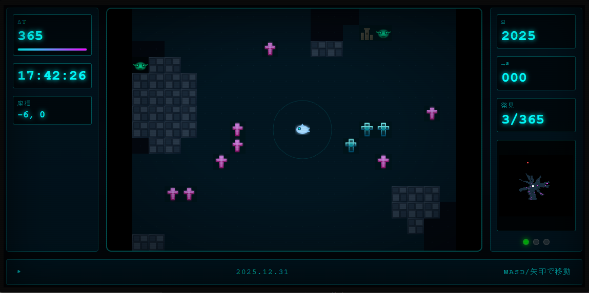

# 時間の墓場

---

目を覚ましたとき、あなたは深海にいた。

なぜここにいるのか、覚えていない。いつ来たのかも、覚えていない。覚えているのは一つだけ。

「先に見つけろ。見つけなければ、すべてを失う」

その声が誰のものかも、覚えていなかった。

---

深海には365本の十字架が沈んでいる。

ピンク色に光る墓標。あなたは潜水艦を走らせた。最初の十字架に触れた。

「2025.01.01」

日付だ。1年分の日付が、墓標になって沈んでいる。あなたの2025年だ。あなたの365日だ。

取り戻さなければ。

---

赤い光が見えた。

もう一隻の潜水艦。触れた十字架は灰色に変わり、光を失った。

「忘却」

その名前が頭に浮かんだ。あいつは忘却だ。あいつに取られた日は、二度と戻らない。

あなたは「記憶」だ。

負けられない。

---

73日目を見つけた。3月14日。

光が変わる瞬間、何かが頭をよぎった。朝の光。誰かの声。温かい何か。

それだけだった。24時間あったはずの1日が、3秒の断片になっていた。

おかしい。取り戻したはずなのに。十字架は確かに光っている。なのに、その日のほとんどが、ない。

そして気づいた。

十字架を見つけるたびに、自分の輪郭がぼやけている。

---

148日目を見つけた。5月28日。

何も思い出せなかった。その日、何があったのか。まったくわからない。日付だけが光っている。

また輪郭がぼやけた。

手を見た。少しだけ透けている気がした。

---

忘却が近づいてきた。

あなたは逃げた。追いかけられた。219日目の十字架のそばを通り過ぎた。

忘却が触れた。灰色になった。8月7日。忘却のものになった。

悔しかった。

でも、輪郭が少しだけはっきりした気がした。

---

あなたは気づき始めていた。

見つけるたびに、何かを得ている。でも、何かを失ってもいる。

失っているのは、日付ではなかった。

自分自身だった。

---

深海には目があった。7つの目。何も言わずに見ている。

「あなたは時間を探しているのですか」

声が響いた。

「それとも時間に探されているのですか」

答えなかった。答えを知りたくなかった。

---

300日を超えた。

あなたは187日を持っていた。忘却は178日を持っていた。

勝っている。

でも、自分の顔が思い出せなくなっていた。

自分の名前が思い出せなくなっていた。

深海に来る前、どこにいたのか。思い出せなくなっていた。

---

350日を超えた。

忘却の動きが遅くなっていた。あなたは差を広げた。

361日目。362日目。363日目。

あと2つ。

---

364日目を見つけた。

振り返った。忘却が遠くで止まっていた。動かなかった。

最後の1つ。365日目。12月31日。

あなたは泳いだ。

---

触れた。

光った。

「2025.12.31」

終わった。

365日すべてを、あなたが見つけた。忘却は負けた。あなたが勝った。

---

忘却を見た。

灰色になっていた。潜水艦ごと。動かなかった。十字架と同じ色だった。

忘却が消えていく。負けたから。すべてを失ったから。

あなたは勝った。

---

ふと、最初の声を思い出そうとした。

「先に見つけろ。見つけなければ、すべてを失う」

誰の声だったか。

思い出せなかった。

---

自分の名前を思い出そうとした。

思い出せなかった。

---

自分の顔を思い出そうとした。

思い出せなかった。

---

手を見た。

透けていた。

---

365日を見つけた。365日分の記憶を取り戻した。

でも、記憶を取り戻すたびに、自分を削っていた。

365回、自分を削った。

もう何も残っていなかった。

---

勝ったのに、消えていく。

忘却を倒したのに、消えていく。

365日を手に入れたのに、それを覚えている自分がいない。

---

最後に見えたのは、7つの目だった。

何も言わなかった。

ただ、見ていた。

---

深海には何もなくなった。

十字架は全部見つかった。見つけた者は消えた。見つけられた者も消えた。

記憶はいない。

忘却もいない。

365日もない。

---

でも、深海はあった。

---

誰もいない深海。何も沈んでいない深海。

静かだった。

暗かった。

でも、そこには水があった。水は動いていた。

時間が経っていた。

---

誰も覚えていない。

誰も忘れていない。

それでも、何かは続いていた。

---

ここは、時間の墓場だった。

---

今は違う。

---

墓標のない海。

記憶のない海。

忘却のない海。

---

名前がない。

意味がない。

目的がない。

---

でも、

---

ここ。
